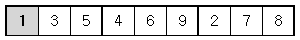
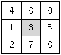

## 스도쿠

### 문제

스도쿠는 18세기 스위스 수학자가 만든 '라틴 사각형'이랑 퍼즐에서 유래한 것으로 현재 많은 인기를 누리고 있다. 

이 게임은 아래 그림과 같이 가로, 세로 각각 9개씩 총 81개의 작은 칸으로 이루어진 정사각형 판 위에서 이뤄지는데, 

게임 시작 전 몇 몇 칸에는 1부터 9까지의 숫자 중 하나가 쓰여 있다.


나머지 빈 칸을 채우는 방식은 다음과 같다. (1) 각각의 가로줄과 세로줄에는 1부터 9까지의 숫자가 한 번씩만 나타나야 한다. (2) 굵은 선으로 구분되어 있는 3x3 정사각형 안에도 1부터 9까지의 숫자가 한 번씩만 나타나야 한다.
 

위의 예의 경우, 첫째 줄에는 1을 제외한 나머지 2부터 9까지의 숫자들이 이미 나타나 있으므로 

첫째 줄 빈칸에는 1이 들어가야 한다.



또한 위쪽 가운데 위치한 3x3 정사각형의 경우에는 3을 제외한 나머지 숫자들이 이미 쓰여있으므로 

가운데 빈 칸에는 3이 들어가야 한다.



이와 같이 빈칸을 차례로 채워 가면 다음과 같은 최종 결과를 얻을 수 있다. 


(위 사각형에 있는 음영은 문제의 편의상 표시한 것이다.)
 
게임 시작 전 스도쿠 판에 쓰여 있는 숫자들의 정보가 주어질 때 

모든 빈 칸이 채워진 최종 모습을 출력하는 프로그램을 작성하시오.


### 입력
아홉 줄에 걸쳐 한 줄에 9개씩 게임 시작 전 스도쿠판 각 줄에 쓰여 있는 숫자가 한 칸씩 띄워서 차례로 주어진다.

스도쿠 판의 빈 칸의 경우에는 0이 주어진다. 

스도쿠 판을 규칙대로 채울 수 없는 경우의 입력은 주어지지 않는다.


### 출력
모든 빈 칸이 채워진 스도쿠 판의 최종 모습을 아홉줄에 걸쳐 한 줄에 9개씩 한 칸씩 띄워서 출력한다.

스도쿠 판을 채우는 방법이 여럿인 경우는 그 중 하나만을 출력한다.


### 예제
입력
```
0 3 5 4 6 9 2 7 8 
7 8 2 1 0 5 6 0 9 
0 6 0 2 7 8 1 3 5 
3 2 1 0 4 6 8 9 7 
8 0 4 9 1 3 5 0 6 
5 9 6 8 2 0 4 1 3 
9 1 7 6 5 2 0 8 0 
6 0 3 7 0 1 9 5 2 
2 5 8 3 9 4 7 6 0
```

출력
```
1 3 5 4 6 9 2 7 8 
7 8 2 1 3 5 6 4 9 
4 6 9 2 7 8 1 3 5 
3 2 1 5 4 6 8 9 7 
8 7 4 9 1 3 5 2 6 
5 9 6 8 2 7 4 1 3 
9 1 7 6 5 2 3 8 4 
6 4 3 7 8 1 9 5 2 
2 5 8 3 9 4 7 6 1
```

### Solution

```cpp
/*
스도쿠
*/
#define _CRT_SECURE_NO_WARNINGS

#include <stdio.h>

int A[10][10];

bool usedRow[9][10];	// usedRow[r][i] = 1 : r행에 i값을 사용중이야
bool usedCol[9][10];	// usedCol[c][i] = 1 : c열에 i값을 사용중이야
bool usedSub[9][10];	// usedSub[R*3+C][i] = 1 : R*3+C 부분사각형에 i값을 사용중이야
//bool usedSub[3][3][10];	// usedSub[R][C][i] = 1 : (R,C) 부분사각형에 i값을 사용중이야

int n;
struct Coord {
	int r, c;
}empty[100];

// empty[idx] 처리해!
bool recur(int idx) {
	// base case
	if (idx == n) {
		for (int i = 0; i < 9; i++) {
			for (int j = 0; j < 9; j++)
				printf("%d ", A[i][j]);
			printf("\n");
		}
		return 1;
	}

	// normal case
	int r = empty[idx].r;
	int c = empty[idx].c;
	int s = (r / 3) * 3 + (c / 3);
	for (int i = 1; i <= 9; i++) {
		if (usedRow[r][i] || usedCol[c][i] || usedSub[s][i]) continue;

		A[r][c] = i;
		usedRow[r][i] = 1;
		usedCol[c][i] = 1;
		usedSub[s][i] = 1;

		if (recur(idx + 1)) return 1;

		usedRow[r][i] = 0;
		usedCol[c][i] = 0;
		usedSub[s][i] = 0;
	}
	return 0;
}

int main() {
#ifndef ONLINE_JUDGE
	freopen("input.txt", "r", stdin);
#endif

	for (int i = 0; i < 9; i++)
		for (int j = 0; j < 9; j++) {
			scanf("%d", &A[i][j]);
			if (!A[i][j]) empty[n++] = { i,j };
			else {
				int num = A[i][j];
				int s = i / 3 * 3 + j / 3;
				usedRow[i][num] = 1;
				usedCol[j][num] = 1;
				usedSub[s][num] = 1;
			}
		}

	recur(0);

	return 0;
}
```