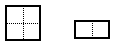
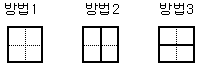

## 두 줄로 타일 깔기

### 문제


아래 그림과 같은 2가지 종류의 타일이 있다.




위의 타일들을 여러 개 사용해서 가로 2칸, 세로 2칸 크기의 판을 채우는 방법은 다음 3가지이다. 

이 때, 타일들을 회전해서 채워 넣는 것도 가능하다. 




위의 2가지 타일들을 여러 개 사용해서 가로 2칸, 세로 N칸 크기의 판을 

채우는 방법은 모두 몇 가지가 되는지 구하는 프로그램을 작성하시오.


### 입력
세로의 칸수 N(1≤N≤100,000) 이 입력된다.


### 출력
가지 수를 20100529로 나눈 나머지를 출력한다.


### 예제
입력
```
6
```

### 출력
```
43
```