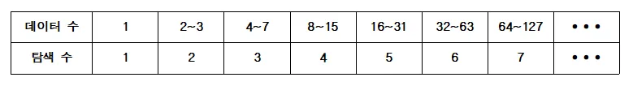

## 이진탐색 (Binary Search)

**[분할 정복 알고리즘(Divide and Conquer Algorithm)]**


주어진 문제의 크기가 감당하기 어려운 경우 보다 작은 문제로 나누어 해결하는 방법(알고리즘)이다.

이진검색, 퀵정렬, 합병정렬 등이 대표적인 예이다.


**[이진 검색(Binary Search)]**

이진 검색(탐색) 알고리즘이란 정렬된 데이터 리스트에서

목표값 또는 목표값이 있는 위치를 빠른 시간에 찾는 분할 정복 알고리즘 중에 하나이다.


예를 들어 정렬된 데이터 배열 A[]가 주어지고 목표값 target 을 찾는다고 가정해보자.

이때 첫 번째 원소의 인덱스는 low 이고, 마지막 원소의 인덱스는 high 라고 하자.


이제 이진 검색 알고리즘 프로세스는 다음과 같다.


1. 현재 탐색 구간의 가운데 배열번호(인덱스) mid를 구한다.

   mid = (low + high) / 2;


2. A[mid]값과 target값을 비교한다.

   (1) 만약 A[mid] == target 이라면 목표값 또는 목표값이 있는 위치를 찾은 것이다.

   (2) 만약​ A[mid] < target 이라면 low = mid+1로 하여 검색범위를 조정한다.

   (3) 만약​ A[mid] > target 이라면 high = mid-1로 하여 검색범위를 조정한다.


3. 탐색구간이 남아 있고 목표값을 찾지 못한 동안 1, 2번 프로세스를 반복한다.

   만약 low > high 라면(탐색구간이 남지 않는 경우) 목표값이 배열에 없는 경우이다.


위 프로세스는 매 루프마다 탐색해야할 범위가 절반 이하로 줄어든다.

데이터 개수와 최대 탐색수를 표로 비교해보면 아래와 같다.​




데이터 수가 2배 늘어날때마다 탐색 수는 1씩 증가하고 있다.

따라서 데이터 수에 따른 탐색수를 일반화 하여 나타내면 밑이 2인 log(n) + 1 임을 알 수 있다.

순차탐색에 비하여 매우 훌륭한 성능을 보여준다.


**[이진탐색 의사코드 - loop version]**

```cpp
binarySearch (A[], low, high, target) :
    while low <= high :
        mid = (low + high) / 2;
        if A[mid] == target:
            return mid

        if A[mid] > target:
            high = mid - 1
        else:
            low = mid + 1

    return -1
```

**[이진탐색 의사코드 - recursive version]**

```cpp
binarySearchRecur (A[], low, high, target):
    if low > high:
        return -1

    mid = (low + high) / 2

    if A[mid] == target:
        return mid

    if( A[mid] > target):
        return binarySearchRecur(A, low, mid-1, target)

    return binarySearchRecur(A, mid+1, high, target)
```

### 문제

N개의 정렬된 데이터가 주어지고 Q개의 질의가 주어진다.

정렬된 데이터에서 목표값이 있는 위치(인덱스)를 찾는 프로그램을 작성하시오.

### 입력
첫 행에 N(1<=N<=500,000​)이 입력된다.

두 번째 행에 ***오름차순으로 정렬***된 N개의 서로 다른 정수 $a_i$ 가 입력된다. (-10억 ~ 10억)

세 번째 행에 Q(100<=Q<=500,000​) 가 입력된다.

네 번째 행에 Q개의 정수 $b_i$ 가 입력된다. (-10억 ~ 10억)


### 출력

Q개의 $b_i$ 에 대하여 각각의 결과를 공백으로 구분하여 하나의 행에 출력한다.

배열의 첫번째 원소는 0번 인덱스에 마지막 원소는 N−1번 인덱스에 저장된다고 가정한다.

찾는 값이 없는 경우 −1을 출력한다.


### 예제1
입력
```
5
1 2 3 4 5
3
-5 5 2
```

출력
```
-1 4 1
```

### 예제2
입력
```
8
-7 -5 -3 0 2 4 6 8
5
-3 6 -7 0 8
```

출력
```
2 6 0 3 7
```