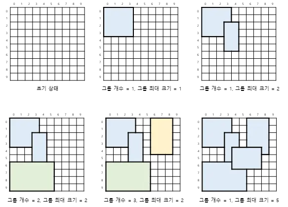

## 직사각형 그룹

### 문제


2차원 평면상에 직사각형이 주어진다.

두 직사각형이 한 개 이상의 셀을 공유하는 경우, 같은 그룹이 된다.

그룹의 크기는 그 그룹에 속한 직사각형 개수로 정의한다.


평면은 비어 있는 상태에서 직사각형이 한 개씩 추가된다.

직사각형이 추가될 때마다 그룹의 개수와 그룹의 최대 크기를 출력한다.


### 입력
첫번째 줄에 추가되는 직사각형의 개수 N이 입력된다.

두번째 줄부터 N개 줄에 걸쳐 직사각형 정보(sr, sc, er, ec)가 입력된다.

직사각형 범위가 (sr,sc) ~ (er,ec) 라는 의미이다.

5 <= N <= 3,000

0 <= sr <= er < 1,000,000

0 <= sc <= ec < 1,000,000


### 출력
N개 줄에 걸쳐 그룹의 개수와 그룹의 최대 크기를 출력한다.


### 예제
입력
```
5
0 0 3 3
2 3 5 4
6 0 9 5
0 6 4 8
4 4 6 7
```

### 출력
```
1 1
1 2
2 2
3 2
1 5
```

