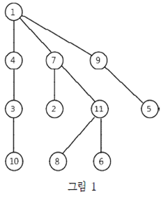

## 트리(중등)

### 문제


트리 T 는 아래 그림 1과 같은 구조를 가지고 있으며 원은 ‘정점’이라 하고, 정점과 정점을 연결하는 선을 ‘에지’라 한다. 

특히 가장 위에 위치한 정점을 ‘루트’라 하는데 오직 하나만 있다. 

N 개의 정점들은 숫자 1부터 N 으로 표현하고 루트는 항상 1이다.

두 정점 v​ 와 w 를 연결하는 경로는 정점들의 순서리스트 (v0, v1, ..., vm) 로, 정점 vi 와 vi+1 은 에지로 연결되고 v0= v, vm= w 이다. 

트리에서는 임의의 두 정점 v 와 w 사이에 항상 두 정점을 연결하는 경로가 오직 하나만 존재한다. 

예를들어, 그림 1에서 정점 3과 11 사이의 유일한 경로는 (3, 4, 1, 7, 11)이다.




각 정점 v​ 에서 루트 r 과 연결하는 유일한 경로 P 에 대해서 정점 v 와 에지로 연결된 정점 중에서 P 상에 있는 정점을 v 의 ‘부모 정점’이라고 한다. 

예를 들어, 그림 1에서 4, 7, 9의 부모 정점은 1이고, 2와 11의 부모 정점은 7이다.

트리 ​ 에서 어떤 두 정점을 연결하는 에지를 제거하면 그 두 정점 외에도 경로가 존재하지 않는 정점 쌍이 있을 수 있다. 

여러분은 “정점 v 와 w 를 연결하는 경로가 존재하는가?”와 같은 질의에 답해야 한다. 

예를 들어, 그림 1에서 7과 11 사이의 에지를 제거하면 8과 5를 연결하는 경로는 존재하지 않는다.

트리 정보가 주어지고, 에지의 제거 정보와 질의가 임의의 순서로 주어질 때, 작업을 순서대로 수행하며 질의에 대한 답을 출력하는 프로그램을 작성하시오.

 


### 입력
표준 입력으로 다음 정보가 주어진다. 

첫 번째 줄에는 트리의 정점의 개수와 질의의 개수를 나타내는 두 정수 N 과 Q (1 ≤ N, Q ≤ 200,000)가 주어진다.

다음 N - 1 개의 줄의 i 번째 줄에는 정점 i + 1 의 부모 정점을 나타내는 정수 a 가 주어진다 (1 ≤ a ≤ N ). 

다음 (N - 1) + Q 개의 줄 중에서 N - 1 개는 (1)의 형태로, Q 개는 (2)의 형태로 주어진다. 

(1) 두 정수 x 와 b 가 주어진다 (x = 0, 2 ≤ b ≤ N ). 

    이것은 b 의 부모 정점과 b 를 연결하는 에지를 제거함을 의미한다. 각 줄의 b 는 모두 다르다. 

(2) 세 정수 x, c, d 가 주어진다 (x = 1, 1 ≤ c, d ≤ N ). 

   이것은 c 와 d 를 연결하는 경로가 존재하는 지 묻는 질의를 의미한다.


### 출력
표준 출력으로 질의에 대한 답을 순서대로 Q​개의 줄에 출력한다. 

각 줄마다 경로가 존재하면 YES를 아니면 NO를 출력한다.


## 부분문제
|번호	|점수	|조건|
|---|---|---|
|#1|	9점	| 1 ≤ N ≤ 1,000, 1 ≤ Q ≤ 1,000 이고 정점 i 의 부모 정점은 정점 i - 1 이다(i = 2, ... , N). |
|#2	|13점	| 1 ≤ N ≤ 1,000, 1 ≤ Q ≤ 1,000 이다. |
|#3	|21점	| 1 ≤ N ≤ 3,000, 1 ≤ Q ≤ 200,000 이다. |
|#4	|28점	| 루트를 제외한 모든 정점의 부모 정점은 서로 다르다. |
|#5	|29점	| 원래의 제약조건 이외에 아무 제약조건이 없다. |


### 예제1
입력
```
3 3 
1 
1 
1 2 3 
0 3 
1 2 3 
1 1 2 
0 2
```

출력
```
YES 
NO 
YES
```

예제2
입력
```
11 5 
7 
4 
1 
9 
11 
1 
11 
1 
3 
7 
0 11 
1 8 5 
1 3 9 
0 10 
0 9 
0 7 
1 2 7 
0 5 
1 1 10 
0 8 
0 6 
0 2 
1 1 3 
0 3 
0 4
```

출력
```
NO 
YES 
YES 
NO 
YES
```