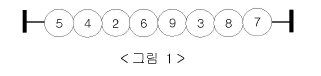
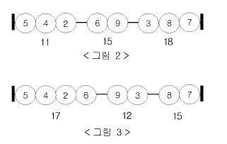

## 숫자구슬(medium)

### 문제


N개의 숫자 구슬이 <그림 1>과 같이 막대에 꿰어져 일자로 놓여 있다. 

이들 구슬은 막대에서 빼낼수 없고 따라서 바꿀 수 없다.





이 숫자 구슬을 M개의 그룹으로 나누었을 때 각각의 그룹의 합 중 최대값이 최소가 되도록 하려 한다. 

예를 들어 세 그룹으로 나눈다고 할 때 <그림 2>와 같이 그룹을 나누면 

그룹의 합은 각각 11, 15, 18이 되어 그 중 최대값은 18이 되고, 

<그림 3>과 같이 나누면 각 그룹의 합은 각각 17, 12, 15가 되어 그 중 최대값은 17이 된다. 

숫자 구슬의 배열이 위와 같을 때는 그룹의 합 중 최대값이 17보다 작게 만들 수는 없다.




각 그룹의 합 중 최대값이 최소가 되도록 M개의 그룹으로 나누었을 때, 

그 최대값을 출력하는 프로그램을 작성하시오. 


### 입력
첫째 줄에 구슬의 개수 N과 그룹의 수 M이 주어진다.

둘째 줄에는 각 구슬이 적혀진 숫자가 왼쪽부터 차례로 주어진다. 

N은 100,000 이하의 자연수, M은 N이하의 자연수이며, 구슬에 적혀진 숫자는 100,000,000 이하의 자연수이다.  


### 출력
각 그룹의 합 중 최대값이 최소가 되도록 M개의 그룹으로 나누었을 때 그 최대값을 첫째 줄에 출력한다.

결과는 long long 범위의 수이다.


### 예제
입력
```
8 3 
5 4 2 6 9 3 8 7
```

출력
```
17
```