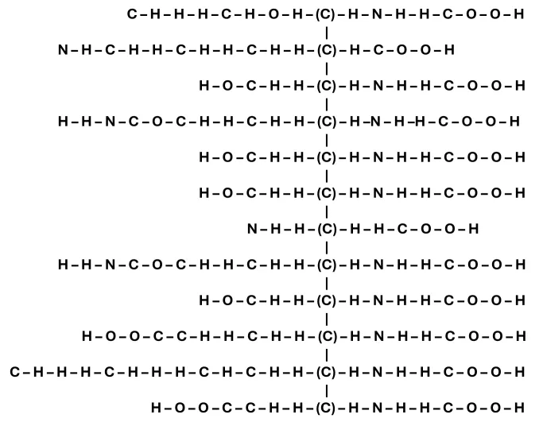
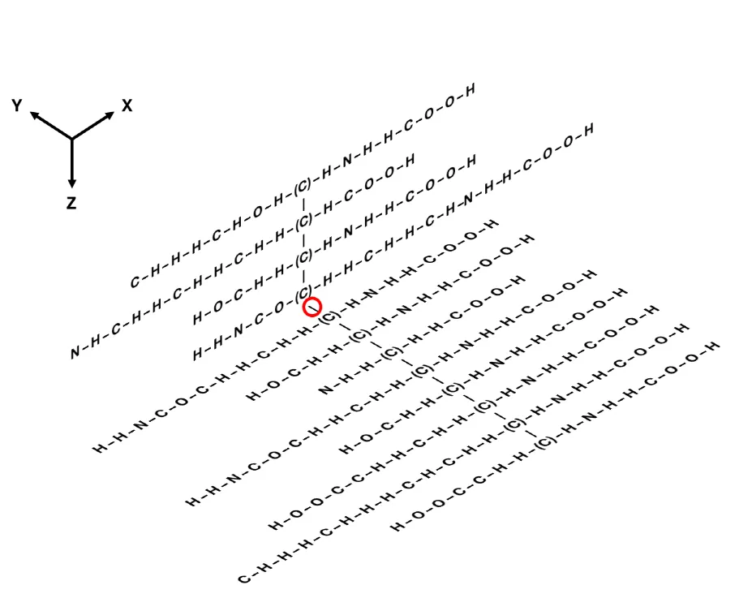
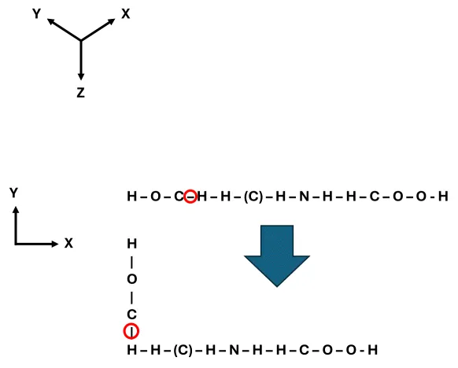

### 문제


**[제한 사항]**

* 메모리 : heap + global + stack = 256MB    단, stack size = 1MB

* 제한시간 10초

* 제출 횟수 제한 10회


**[주의 사항]**

1. User Code 안에는  malloc.h 외에 어떤 헤더파일도 추가할 수 없다.

2. 채점시 main.cpp 는 그대로 사용된다. 단, seed는 변경될 수 있다.

   치팅 방지를 위한 코드가 추가될 수 있다.

3. 제출한 코드에 대하여 엄격한 코드 리뷰를 실시한다.

   따라서 main.cpp의 변수에 직접 접근할 수 없다.

4. 본 검정은 c++만 지원한다.


**[문제 설명]**

1. 100 x 100 x 100 의 3차원 공간에 여러 개의 아미노산이 연결된 한 개의 단백질(Protein)이 존재한다.

2. 각 아미노산(Amino Acid)은 C, H, O, N, S 분자들이 한 줄로 연결된 구조이다. 이 분자들을 element 라고 한다.

3. 각 아미노산에는 커넥터가 1개씩 존재하며, 아미노산들은 커넥터를 기준으로 한 줄로 연결되어 있다.

4. 당신은 fold_amino(), fold_element() 함수를 호출하여 아미노산을 접을 수 있다.

5. [Fig. 1] 은 이 문제에서 제공되는 첫번째 테스트 케이스의 아미노산 서열이다.
(C) 는 커텍터를 의미한다.





**[API]**


* user.cpp에서 구현해야 하는 API함수는 다음과 같다.


```cpp
void process(void) {
    return ;
}
```
process()함수를 작성하여 SCORE를 최대화 하라.


* main.cpp에서 제공하는 API함수는 다음과 같다.


```cpp
int protein(Element elements[][])
```
단백질의 아미노산 서열 정보를 전달한다.


```cpp
void fold_amino(int aminoNum, bool front, int axis, bool anticlockwise)
```
아미노산을 커넥터를 기준으로 접는다.




```cpp
void fold_element (int aminoNum, int elementNum, bool front, int axis, bool anticlockwise)
```
아미노산을 element 를 기준으로 접는다.




※ 기타 자세한 내용은 주어진 코드를 분석하라.

### Code_template

```cpp
// main.cpp
#ifndef _CRT_SECURE_NO_WARNINGS
#define _CRT_SECURE_NO_WARNINGS
#endif

#include <stdio.h>
#include <stdlib.h>

static unsigned long long seed = 1234;
static int pseudo_rand(void)
{
	seed = seed * 25214903917ULL + 11ULL;
	return (seed >> 16) & 0x3fffffff;
}

/* These constant variables will NOT be changed */
static const int MAX_TC = 10;
static const int AMINO_TYPE = 20;
static const int AMINO_LEN = 28;
static const int MAX_AMINO = 20;
static const int SPACE_LEN = 100;

typedef struct {
	char elements[AMINO_LEN];
	int connectorIdx;
} AminoType;

const static AminoType gAminoType[AMINO_TYPE] = {
	{ "CHHHCHNHHCOOH",               4 },
	{ "HNCNHHNHCHHCHHCHHCHNHHCOOH", 17 },
	{ "HHNCOCHHCHNHHCOOH",           8 },
	{ "HOOCCHHCHNHHCOOH",            7 },
	{ "HSCHHCHNHHCOOH",              5 },
	{ "HHNCOCHHCHHCHNHHCOOH",       11 },
	{ "HOOCCHHCHHCHNHHCOOH",        10 },
	{ "NHHCHHCOOH",                  3 },
	{ "NHCHNCHCCHHCHNHHCOOH",       11 },
	{ "CHHHCHHCHCHHHCHNHHCOOH",     13 },
	{ "CHHHCHHHCHCHHCHNHHCOOH",     13 },
	{ "HHNCHHCHHCHHCHHCHNHHCOOH",   15 },
	{ "CHHHSCHHCHHCHNHHCOOH",       11 },
	{ "CHHCHNHHCOOH",                3 },
	{ "NHCHHCHHCHHCHCOOH",          11 },
	{ "HOCHHCHNHHCOOH",              5 },
	{ "CHHHCHOHCHNHHCOOH",           8 },
	{ "NHCHCCHHCHNHHCOOH",           8 },
	{ "HOCHHCHNHHCOOH",              5 },
	{ "CHHHCHHCHCHNHHCOOH",         9 }
};

typedef struct {
	char symbol;
	bool connector;
	int x, y, z;
} Element;

static Element gElements[MAX_AMINO][AMINO_LEN];
static int gElementSize[MAX_AMINO];
static int gAminoCount;

static long long gTotalScore;

static void rotate(int aminoIdx, int firstElemIdx, int lastElemIdx, Element& baseElem, int axis, bool anticlockwise)
{
	int dir = (anticlockwise) ? 1 : -1;

	for (int elemIdx = firstElemIdx; elemIdx <= lastElemIdx; elemIdx++) {
		Element srcElem = gElements[aminoIdx][elemIdx];
		Element& destElem = gElements[aminoIdx][elemIdx];

		if (axis == 0) {
			destElem.y = dir * -(srcElem.z - baseElem.z) + baseElem.y;
			destElem.z = dir * (srcElem.y - baseElem.y) + baseElem.z;
		}
		else if (axis == 1) {
			destElem.z = dir * -(srcElem.x - baseElem.x) + baseElem.z;
			destElem.x = dir * (srcElem.z - baseElem.z) + baseElem.x;
		}
		else if (axis == 2) {
			destElem.x = dir * -(srcElem.y - baseElem.y) + baseElem.x;
			destElem.y = dir * (srcElem.x - baseElem.x) + baseElem.y;
		}
	}
}

////////////////////////////////////

int protein(Element elements[MAX_AMINO][AMINO_LEN])
{
	int aminoIdx, elemIdx;

	for (aminoIdx = 0; aminoIdx < gAminoCount; aminoIdx++) {
		for (elemIdx = 0; gElements[aminoIdx][elemIdx].symbol; elemIdx++)
			elements[aminoIdx][elemIdx] = gElements[aminoIdx][elemIdx];
		elements[aminoIdx][elemIdx].symbol = 0;
	}
	return gAminoCount;
}

void fold_amino(int aminoNum, bool front, int axis, bool anticlockwise)
{
	int elementNum;

	for (elementNum = 0; gElements[aminoNum][elementNum].connector == false; elementNum++);
	Element& baseElem = gElements[aminoNum][elementNum];

	int firstAminoIdx = (front) ? 0 : aminoNum + 1;
	int lastAminoIdx = (front) ? aminoNum - 1 : gAminoCount - 1;

	for (int aminoIdx = firstAminoIdx; aminoIdx <= lastAminoIdx; aminoIdx++)
		rotate(aminoIdx, 0, gElementSize[aminoIdx] - 1, baseElem, axis, anticlockwise);
}

void fold_element(int aminoNum, int elementNum, bool front, int axis, bool anticlockwise)
{
	Element& baseElem = gElements[aminoNum][elementNum];

	int firstElemIdx = (front) ? 0 : elementNum + 1;
	int lastElemIdx = (front) ? elementNum - 1 : gElementSize[aminoNum] - 1;

	for (int i = firstElemIdx; i <= lastElemIdx; i++)
	{
		if (gElements[aminoNum][i].connector == true)
			return;
	}
	rotate(aminoNum, firstElemIdx, lastElemIdx, baseElem, axis, anticlockwise);
}

////////////////////////////////////

static void init()
{
	gAminoCount = MAX_AMINO / 2 + pseudo_rand() % (MAX_AMINO / 2);

	for (int aminoIdx = 0; aminoIdx < gAminoCount; aminoIdx++) {
		int aminoType = pseudo_rand() % AMINO_TYPE;
		int connIdx = gAminoType[aminoType].connectorIdx;

		int x = SPACE_LEN / 2 - connIdx;
		int y = SPACE_LEN / 2;
		int z = SPACE_LEN / 2 + aminoIdx;

		int elemIdx;
		for (elemIdx = 0; gAminoType[aminoType].elements[elemIdx]; elemIdx++) {
			gElements[aminoIdx][elemIdx].symbol = gAminoType[aminoType].elements[elemIdx];
			gElements[aminoIdx][elemIdx].x = x + elemIdx;
			gElements[aminoIdx][elemIdx].y = y;
			gElements[aminoIdx][elemIdx].z = z;
			gElements[aminoIdx][elemIdx].connector = false;
		};
		gElements[aminoIdx][elemIdx].symbol = 0;
		gElements[aminoIdx][connIdx].connector = true;
		gElementSize[aminoIdx] = elemIdx;
	}
}

static int gSpace[SPACE_LEN][SPACE_LEN][SPACE_LEN];


static bool verify()
{
	for (int z = 0; z < SPACE_LEN; z++)
		for (int y = 0; y < SPACE_LEN; y++)
			for (int x = 0; x < SPACE_LEN; x++)
				gSpace[z][y][x] = 0;

	for (int aminoIdx = 0; aminoIdx < gAminoCount; aminoIdx++) {
		for (int elemIdx = 0; gElements[aminoIdx][elemIdx].symbol; elemIdx++) {
			int x = gElements[aminoIdx][elemIdx].x;
			int y = gElements[aminoIdx][elemIdx].y;
			int z = gElements[aminoIdx][elemIdx].z;

			if (x < 0 || x >= SPACE_LEN || y < 0 || y >= SPACE_LEN || z < 0 || z >= SPACE_LEN
				|| gSpace[z][y][x])
				return false;

			switch (gElements[aminoIdx][elemIdx].symbol) {
			case 'H': gSpace[z][y][x] = 1; break;
			case 'C': gSpace[z][y][x] = 2; break;
			case 'O': gSpace[z][y][x] = 5; break;
			case 'N': gSpace[z][y][x] = 10; break;
			case 'S': gSpace[z][y][x] = 30; break;
			}
		}
	}
	int cnt = 0;
	for (int z = 1; z < SPACE_LEN - 1; z++)
		for (int y = 1; y < SPACE_LEN - 1; y++)
			for (int x = 1; x < SPACE_LEN - 1; x++) {

				gTotalScore = gTotalScore +
					gSpace[z][y][x] * gSpace[z - 1][y][x] + gSpace[z][y][x] * gSpace[z + 1][y][x] +
					gSpace[z][y][x] * gSpace[z][y - 1][x] + gSpace[z][y][x] * gSpace[z][y + 1][x] +
					gSpace[z][y][x] * gSpace[z][y][x - 1] + gSpace[z][y][x] * gSpace[z][y][x + 1];
			}

	return true;
}

extern void process();

int main(int argc, char* argv[])
{
	setbuf(stdout, NULL);

	gTotalScore = 0;
	for (int tc = 0; tc < MAX_TC; ++tc) {

		init();

		process();

		if (verify() == false) {
			gTotalScore = 0;
			break;
		}
	}

	long long SCORE = gTotalScore;
	printf("SCORE: %lld\n", SCORE);

	/////// codepas cut이므로 실제와 다를수 있습니다. !!! /////
	if (SCORE >= 102000) {
		printf("PASS\n");
	}
	else {
		printf("FAIL\n");
	}
	///////////////////////////////////////////////////////////

	return 0;
}


// user.cpp

static const int AMINO_LEN = 28;
static const int MAX_AMINO = 20;


typedef struct {
	char symbol;
	bool connector;
	int x, y, z;
} Element;


extern int protein(Element elements[MAX_AMINO][AMINO_LEN]);
extern void fold_amino(int aminoNum, bool front, int axis, bool anticlockwise);
extern void fold_element(int aminoNum, int elementNum, bool front, int axis, bool anticlockwise);


void process()
{

}
```