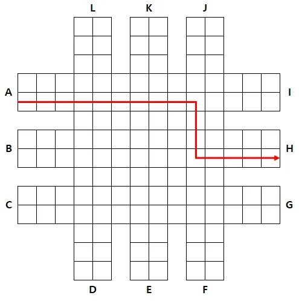
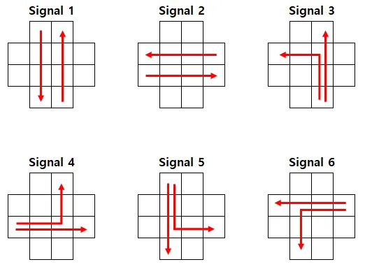

## EX 교차로 신호제어

### 문제


**[제한 사항]**

* 메모리 : heap + global + stack = 256MB    단, stack size = 1MB

* 제한시간 20초

* 제출 횟수 제한 10회

 

 

**[주의 사항]**

1. User Code 안에는  malloc.h 외에 어떤 헤더파일도 추가할 수 없다.

2. 채점시 main.cpp 는 그대로 사용된다. 단, seed는 변경될 수 있다.

   치팅 방지를 위한 코드가 추가될 수 있다.

3. 제출한 코드에 대하여 엄격한 코드 리뷰를 실시한다.

   따라서 main.cpp의 변수에 직접 접근할 수 없다.

4. 본 검정은 c++만 지원한다.


**[문제 설명]**

1000x1000 맵에 왕복 2차선 도로가 최대 100개 주어진다.

2개의 도로가 교차되는 곳에는 교차로 신호가 존재한다.

당신은 main 의 change_signal 함수를 이용하여 교차로 신호를 제어할 수 있다.

map에는 1000대의 차량이 존재하며, 시작 위치와 도착 위치가 주어진다.

차량의 시작위치와 도착위치는 도로의 가장자리이며 시작 위치와 도착위치가 같은 경우는 주어지지 않는다.

당신은 교차로의 신호를 제어하여 모든 차량이 목적지에 도달하도록 해야한다.

다음은 시작 위치가 A이고, 도착 위치가 H 인 차량이 이동하는 경로의 예시이다.




각 차량은 0에서 N-1의 index 순으로 번호가 부여된다.

차량이 움직이는 조건은 아래와 같으며, main.cpp에는 아래 조건에 맞게 차량이 이동하도록 구현되어 있다.

1. 각 차량는 1턴에 상하좌우 인접한 칸 중에 하나로 1칸 씩만 이동할 수 있다.

2. 현재 턴 기준으로 이동하려는 위치에 다른 차량이 있는 경우 이동할 수 없다.

3. 여러 대의 차량이 같은 위치로 이동하려고 하는 경우 번호가 가장 작은 차량이 움직인다.

4. 차량은 목적지까지 최단 경로를 계산하여 직진, 좌회전, 우회전을 판단한다.

- 우선순위가 같다면 직진을 우선으로 한다.

- 최단 경로를 계산할 때, 신호는 고려하지 않는다.

5. 차량이 목적위치에 도착하면 map 에서 제거된다.


**[API]**


* user.cpp에서 구현해야 하는 API함수는 다음과 같다.


```cpp
void init(int N, struct Vehicle mVechicles[], int mMap[][MAXM], int mCrossroadID[][MAXM])
```
N은 차량 댓수이며, 항상 1000 대로 주어진다.

mVehicles 에는 차량의 시작 위치, 진행 방향, 도착 위치가 저장되어 주어진다.

mMap 에는 지도의 정보가 저장되어 있다. 0은 차가 다닐 수 없는 길이고, 1은 차가 다닐수 있는 길을 의미한다

mCrossroadID 는 교차로의 ID가 저장되어 주어진다. 교차로 ID는 1부터 순차적으로 증가한다.

 
```cpp
bool process(void) {
    return true;
}
```
유저가 구현해야 하는 함수이다.
모든 차량이 목적지에 도착한 경우 true를 반환한다.


* main.cpp에서 제공하는 API함수는 다음과 같다.

```cpp
void change_signal(int mCrossID, int mNextSignal)
```
mCrossID교차로에 위치하는 신호의 값을 변경한다.

신호를 변경할 경우, 직진이나 좌회전하는 차량은 1 턴 동안 교차로에 진입할 수 없다.

설정가능한 신호는 6 가지 이며, 각 값에 대응하는 신호는 다음 그림과 같다.




우회전은 신호와 상관 없이 항상 가능하다.


기타 자세한 내용은 주어진 코드를 분석하라.

**[C++ Code Template]**

```cpp
// user.cpp
const int MAXM = 1000;

struct Vehicle
{
	int y, x, dir, dest_y, dest_x;
};

extern void change_signal(int mCrossID, int mNextSignal);

void init(int N, Vehicle mVehicles[], int mMap[][MAXM], int mSignalID[][MAXM]) {

}

bool process(void) {
	return true;
}


// main.cpp
#ifndef _CRT_SECURE_NO_WARNINGS
#define _CRT_SECURE_NO_WARNINGS
#endif

#include <stdio.h>

static unsigned long long seed = 5;
static int pseudo_rand(void)
{
	seed = seed * 25214903917ULL + 11ULL;
	return (seed >> 16) & 0x3fffffff;
}

/* These constant variables will NOT be changed */
static const long long PENALTY = 10'000'000'000'000LL;
static const int MAX_TC = 10;

const int MAXN = 1000;
const int MAXM = 1000;
const int ROAD_CNT = 100;

struct Coordinates
{
	int y, x;
	Coordinates()
	{
		y = x = 0;
	}
	Coordinates(int _y, int _x)
	{
		y = _y;
		x = _x;
	}
};
struct TrafficSignal
{
	int signal, next_signal;
	TrafficSignal()
	{
		signal = next_signal = 0;
	}
};

struct Vehicle
{
	int y, x, dir, dest_y, dest_x;
};

static Coordinates src[ROAD_CNT * 2], dest[ROAD_CNT * 2];
static int K, L;

static long long gTotalScore;

static int map[MAXM][MAXM];
static int map_bak[MAXM][MAXM];
static int crossroad_id[MAXM][MAXM];
static int crossroad_id_bak[MAXM][MAXM];
static TrafficSignal signal_list[ROAD_CNT * ROAD_CNT];
static Vehicle vehicles[MAXN];
static Vehicle vehicles_bak[MAXN];
static int vehicle_on_map[MAXM][MAXM];

static int dy[4] = { -1, 0, 1, 0 };
static int dx[4] = { 0, 1, 0, -1 };

static int is_movable[MAXN];
static int turn_dir[MAXN];

static int min_y, max_y, min_x, max_x;

static const int UP = 0;
static const int RIGHT = 1;
static const int DOWN = 2;
static const int LEFT = 3;

static const int VERTICAL = 1;
static const int HORIZONTAL = 2;
static const int UPLEFT = 3;
static const int RIGHTUP = 4;
static const int DOWNRIGHT = 5;
static const int LEFTDOWN = 6;

static const int TURN_LEFT = 3;
static const int GO_STRAIGHT = 0;
static const int TURN_RIGHT = 1;

////////////////////////////////////

extern void init(int N, Vehicle mVehicles[], int mMap[][MAXM], int mSignalID[][MAXM]);
extern bool process();

////////////////////////////////////

void change_signal(int cross_id, int next_signal)
{
	if (next_signal <= 0 || next_signal > 6)
		return;

	signal_list[cross_id].signal = 0;
	signal_list[cross_id].next_signal = next_signal;
}

static void make_tc()
{
	K = L = 0;
	min_y = MAXM - 1, min_x = MAXM - 1, max_y = 0, max_x = 0;

	for (int y = 0; y < MAXM; y++)
		for (int x = 0; x < MAXM; x++)
			crossroad_id[y][x] = map[y][x] = 0;

	for (int i = 0; i < ROAD_CNT; i++)
	{
		int dir = pseudo_rand() % 2;

		if (dir == 0)
		{
			int y = pseudo_rand() % (MAXM - 200) + 100;

			if (map[y - 1][0] == 1 || map[y][0] == 1 || map[y + 1][0] == 1 || map[y + 2][0] == 1)
				continue;

			for (int x = 0; x < MAXM; x++)
			{
				map[y + 1][x] = map[y][x] = 1;
			}

			src[K] = Coordinates(y + 1, 0);
			dest[K++] = Coordinates(y, 0);
			src[K] = Coordinates(y, MAXM - 1);
			dest[K++] = Coordinates(y + 1, MAXM - 1);

			if (min_y > y)
				min_y = y;
			if (max_y < y)
				max_y = y;
		}
		else
		{
			int x = pseudo_rand() % (MAXM - 200) + 100;

			if (map[0][x - 1] == 1 || map[0][x] == 1 || map[0][x + 1] == 1 || map[0][x + 2] == 1)
				continue;

			for (int y = 0; y < MAXM; y++)
			{
				map[y][x + 1] = map[y][x] = 1;
			}

			src[K] = Coordinates(0, x);
			dest[K++] = Coordinates(0, x + 1);
			src[K] = Coordinates(MAXM - 1, x + 1);
			dest[K++] = Coordinates(MAXM - 1, x);

			if (min_x > x)
				min_x = x;
			if (max_x < x)
				max_x = x;
		}
	}

	L = 0;
	for (int y = 100; y <= MAXM - 100; y++)
	{
		if (map[y - 1][0] == 0 && map[y][0] == 1)
		{
			for (int x = 100; x <= MAXM - 100; x++)
			{
				if (map[y - 1][x] == 1 && map[y - 1][x - 1] == 0)
				{
					L++;
					crossroad_id[y][x] = crossroad_id[y + 1][x] = crossroad_id[y][x + 1] = crossroad_id[y + 1][x + 1] = L;
					signal_list[L].signal = signal_list[L].next_signal = 1;
				}
			}
		}
	}

	for (int i = MAXN - 1; i >= 0; i--)
	{
		int src_idx = 0, dest_idx = 0;
		do
		{
			src_idx = pseudo_rand() % K;
			dest_idx = pseudo_rand() % K;
		} while (src_idx == dest_idx);

		vehicles[i].y = src[src_idx].y;
		vehicles[i].x = src[src_idx].x;
		vehicles[i].dest_y = dest[dest_idx].y;
		vehicles[i].dest_x = dest[dest_idx].x;

		if (vehicles[i].y < 100)
		{
			src[src_idx].y++;
			vehicles[i].dir = DOWN;
		}
		else if (vehicles[i].y > MAXM - 100)
		{
			src[src_idx].y--;
			vehicles[i].dir = UP;
		}
		else if (vehicles[i].x < 100)
		{
			src[src_idx].x++;
			vehicles[i].dir = RIGHT;
		}
		else
		{
			src[src_idx].x--;
			vehicles[i].dir = LEFT;
		}
	}

	for (int y = 0; y < MAXM; y++)
	{
		for (int x = 0; x < MAXM; x++)
		{
			map_bak[y][x] = map[y][x];
			crossroad_id_bak[y][x] = crossroad_id[y][x];
			vehicle_on_map[y][x] = 0;
		}
	}

	for (int i = 0; i < MAXN; i++)
	{
		vehicles_bak[i] = vehicles[i];
		vehicle_on_map[vehicles[i].y][vehicles[i].x] = 1;
	}
}

static int get_nextdir(Vehicle& tar)
{
	int dest_y = tar.dest_y;
	int dest_x = tar.dest_x;
	int dir = tar.dir;
	int next_y = tar.y + dy[dir];
	int next_x = tar.x + dx[dir];

	if (dest_y < next_y - 1)
	{
		if (dest_x < next_x - 1)
		{
			if (dir == RIGHT)
			{
				return TURN_LEFT;
			}
			else if (dir == DOWN)
			{
				return TURN_RIGHT;
			}
			else if (dir == UP)
			{
				if (next_y <= min_y + 1)
					return TURN_LEFT;
			}
			else if (dir == LEFT)
			{
				if (next_x <= min_x + 1)
					return TURN_RIGHT;
			}
		}
		else if (dest_x > next_x + 1)
		{
			if (dir == RIGHT)
			{
				if (next_x >= max_x - 1)
					return TURN_LEFT;
			}
			else if (dir == DOWN)
			{
				return TURN_LEFT;
			}
			else if (dir == UP)
			{
				if (next_y <= min_y + 1)
					return TURN_RIGHT;
			}
			else if (dir == LEFT)
			{
				return TURN_RIGHT;
			}
		}
		else
		{
			if (dir == RIGHT)
				return TURN_LEFT;
			else if (dir == LEFT)
				return TURN_RIGHT;
		}
	}
	else if (dest_y > next_y + 1)
	{
		if (dest_x < next_x - 1)
		{
			if (dir == RIGHT)
			{
				return TURN_RIGHT;
			}
			else if (dir == DOWN)
			{
				if (next_y >= max_y - 1)
					return TURN_RIGHT;
			}
			else if (dir == UP)
			{
				return TURN_LEFT;
			}
			else if (dir == LEFT)
			{
				if (next_x <= min_x + 1)
					return TURN_LEFT;
			}
		}
		else if (dest_x > next_x + 1)
		{
			if (dir == RIGHT)
			{
				if (next_x >= max_x - 1)
					return TURN_RIGHT;
			}
			else if (dir == DOWN)
			{
				if (next_y >= max_y - 1)
					return TURN_LEFT;
			}
			else if (dir == UP)
			{
				return TURN_RIGHT;
			}
			else if (dir == LEFT)
			{
				return TURN_LEFT;
			}
		}
		else
		{
			if (dir == RIGHT)
			{
				return TURN_RIGHT;
			}
			else if (dir == LEFT)
			{
				return TURN_LEFT;
			}
		}
	}
	else
	{
		if (dest_x < next_x - 1)
		{
			if (dir == DOWN)
			{
				return TURN_RIGHT;
			}
			else if (dir == UP)
			{
				return TURN_LEFT;
			}
		}
		else if (dest_x > next_x + 1)
		{
			if (dir == DOWN)
			{
				return TURN_LEFT;
			}
			else if (dir == UP)
			{
				return TURN_RIGHT;
			}
		}
	}
	return GO_STRAIGHT;
}

static void move_vehicles()
{
	for (int i = 0; i < MAXN; i++)
		is_movable[i] = 0;

	for (int i = 0; i < MAXN; i++)
	{
		int y = vehicles[i].y;
		int x = vehicles[i].x;
		int dir = vehicles[i].dir;
		int next_y = y + dy[dir];
		int next_x = x + dx[dir];
		int dest_y = vehicles[i].dest_y;
		int dest_x = vehicles[i].dest_x;

		if (y == dest_y && x == dest_x)
			continue;

		if (vehicle_on_map[next_y][next_x] == 1)
			continue;

		if (crossroad_id[next_y][next_x] == 0)
		{
			is_movable[i] = 1;
		}
		else
		{
			if (crossroad_id[y][x] == 0)
			{
				int signal = signal_list[crossroad_id[next_y][next_x]].signal;
				turn_dir[i] = get_nextdir(vehicles[i]);

				if (turn_dir[i] == TURN_RIGHT)
				{
					is_movable[i] = 1;
				}
				else
				{
					if (dir == UP && signal == UPLEFT)
						is_movable[i] = 1;
					else if (dir == RIGHT && signal == RIGHTUP)
						is_movable[i] = 1;
					else if (dir == DOWN && signal == DOWNRIGHT)
						is_movable[i] = 1;
					else if (dir == LEFT && signal == LEFTDOWN)
						is_movable[i] = 1;

					if (turn_dir[i] == GO_STRAIGHT)
					{
						if ((dir == UP || dir == DOWN) && (signal == VERTICAL))
							is_movable[i] = 1;
						else if ((dir == LEFT || dir == RIGHT) && signal == HORIZONTAL)
							is_movable[i] = 1;
					}
				}
			}
			else
			{
				is_movable[i] = 1;
			}
		}
	}

	for (int i = 0; i < MAXN; i++)
	{
		if (is_movable[i] == 0)
			continue;

		int dir = vehicles[i].dir;
		int y = vehicles[i].y;
		int x = vehicles[i].x;
		int next_y = y + dy[dir];
		int next_x = x + dx[dir];

		if (vehicle_on_map[next_y][next_x] == 0)
		{
			vehicles[i].y = next_y;
			vehicles[i].x = next_x;
			vehicle_on_map[y][x] = 0;
			vehicle_on_map[next_y][next_x] = 1;

			if (turn_dir[i] == TURN_RIGHT)
			{
				vehicles[i].dir = (vehicles[i].dir + 1) % 4;
				turn_dir[i] = GO_STRAIGHT;
			}
			else if (turn_dir[i] == TURN_LEFT)
			{
				int next_dir = (vehicles[i].dir + 3) % 4;
				if (next_dir == UP)
				{
					if (map[next_y + 1][next_x + 1] == 0)
					{
						vehicles[i].dir = next_dir;
						turn_dir[i] = GO_STRAIGHT;
					}
				}
				else if (next_dir == RIGHT)
				{
					if (map[next_y + 1][next_x - 1] == 0)
					{
						vehicles[i].dir = next_dir;
						turn_dir[i] = GO_STRAIGHT;
					}
				}
				else if (next_dir == DOWN)
				{
					if (map[next_y - 1][next_x - 1] == 0)
					{
						vehicles[i].dir = next_dir;
						turn_dir[i] = GO_STRAIGHT;
					}
				}
				else if (next_dir == LEFT)
				{
					if (map[next_y - 1][next_x + 1] == 0)
					{
						vehicles[i].dir = next_dir;
						turn_dir[i] = GO_STRAIGHT;
					}
				}
			}
		}
		if (vehicles[i].y == vehicles[i].dest_y && vehicles[i].x == vehicles[i].dest_x)
		{
			vehicle_on_map[vehicles[i].y][vehicles[i].x] = 0;
		}
	}

	for (int i = 1; i <= L; i++)
	{
		signal_list[i].signal = signal_list[i].next_signal;
	}
}

static bool verify()
{
	for (int i = 0; i < MAXN; i++)
	{
		if (vehicles[i].y != vehicles[i].dest_y || vehicles[i].x != vehicles[i].dest_x)
			return false;
	}
	return true;
}


int main()
{
	setbuf(stdout, NULL);

	gTotalScore = 0;

	for (int tc = 0; tc < MAX_TC; ++tc) {
		make_tc();

		init(MAXN, vehicles_bak, map_bak, crossroad_id_bak);

		bool is_finished = false;
		while (is_finished == false)
		{
			is_finished = process();
			move_vehicles();
			gTotalScore++;
		}

		if (verify() == false) {
			gTotalScore = PENALTY;
			break;
		}
	}

	long long SCORE = gTotalScore;
	//printf("SCORE: %lld\n", SCORE);

	//////////////////////////////////////////////////////////
	if (SCORE > 17800)
		puts("FAIL");
	else
		puts("PASS");
	//////////////////////////////////////////////////////////

	return 0;
}
```
