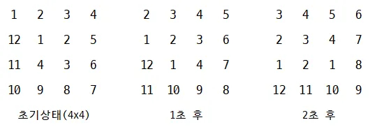

## 숫자 소용돌이

### 문제


알고리즘을 풀다가 어려움을 느낀 영조는 심심함을 못 이기고, 다음과 같은 숫자 소용돌이를 만들기 시작했다.

- 먼저 n×m모양의 직사각형 모양 보드판에 숫자들을 나열한다.

- 보드판의 맨 외곽 직사각형 테두리를 한 회로라고 하자. 즉 첫 번째 회로는, x좌표가 1 또는 n이거나, y좌표가 1 또는 m인 숫자들의 집합이다.

- 두 번째 회로는 외곽 테두리를 빼고 남은 보드판의 외곽 사각형 테두리다. 세 번째는 그 다음 테두리다. 이런 식으로 보드의 가장 내부까지 회로를 찾는다.

- 각 회로별로, 매 초마다 한 칸씩 숫자들을 반시계 방향으로 회전시킨다.

예를 들어 매 초마다 보드판의 상태는 다음과 같다. 




영조의 일탈로 만들어진 이 숫자 소용돌이를 보던 정올쌤은, 스스로가 만든 프로그램에서의 r초 후 상황을 출력하는 프로그램을 만들라고 숙제를 내 주었다. 

프로그램을 잘 만드는 당신이 영조의 숙제를 도와주자.


### 입력
첫째 줄에 n과 m, 그리고 r이 주어진다.

n과 m중 더 작은 수는 무조건 짝수이다.(이는 맨 가운데 회로가 반드시 빈칸 없이 존재한다는 것을 의미한다.) (2≤n,m≤300, 1≤r≤10^9)

다음 n개 줄에는 m개의 정수가 주어지며, 이는 각 좌표별로 보드판에 써 있는 숫자들의 초기 상태이다. 

정수들은 10^9 이하이다. 입력 데이터의 50%에 있어서 1≤r≤1,000을 만족함을 보장한다.


### 출력
r초 후 보드판의 상태를 출력한다.


### 예제
입력
```
4 4 2 
1 2 3 4 
5 6 7 8 
9 10 11 12 
13 14 15 16
```

출력
```
3 4 8 12 
2 11 10 16 
1 7 6 15 
5 9 13 14
```