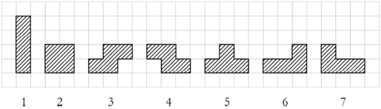
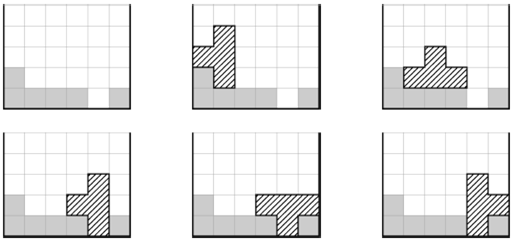

## 테트리스

### 문제


테트리스는 C열과 무제한의 행에 다음과 같은 일곱 가지의 조각을 이동하여 모양을 맞추면 필드를 삭제하는 컴퓨터 게임이다.



조각을 90°, 180° 또는 270°회전할 수 있고 좌우로 이동하며, 바닥으로 떨어뜨릴 수 있다. 조각을 떨어뜨렸을 때는 빈 공간이 생기지 않아야 한다.


예를 들어 6열에 이미 쌓여있는 조각의 높이가 2, 1, 1, 1, 0, 1의 상태에서 5번 조각을 빈 공간이 생기지 않게 떨어뜨릴 수 있는 가짓수는 5가지이다.




모든 열과 필드에 초기상태의 높이가 주어지면 조각을 빈 공간이 생기지 않게 떨어뜨릴 수 있는 가짓수를 구하는 프로그램을 작성하시오.


### 입력
첫 번째 줄 열을 나타내는 C(1≤C≤100)와 조각의 번호 P(1≤P≤7)가 공백으로 구분하여 주어진다. 두 번째 줄에 C개의 정수가 공백으로 구분하여 주어진다. 이는 각 열의 초기 높이로, 0~100의 숫자이다.


### 출력
한 줄에 공백이 없이 조각을 떨어뜨릴 수 있는 경우의 가짓수를 출력한다.


### 예제1
입력
```
6 5
2 1 1 1 0 1
```

출력
```
5
```

### 예제2
입력
```
5 1
0 0 0 0 0
```

출력
```
7
```

### 예제3
입력
```
9 4
4 3 5 4 6 5 7 6 6
```

출력
```
1
```