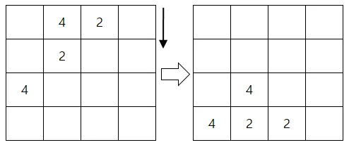
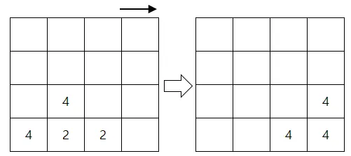
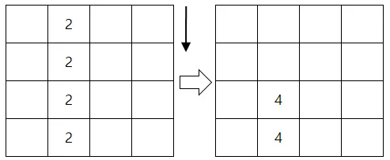
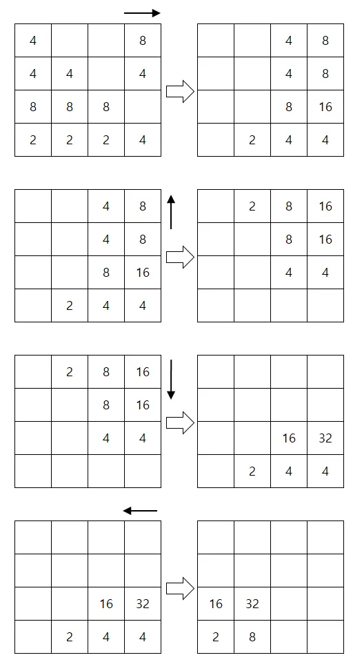

## 2048

문제


2048 게임은 N x N 보드에서 중력을 이용해 즐기는 게임이다. 2048 게임에서는 상하좌우 중 한 방향을 선택하면 중력으로 보드의 모든 숫자 블록은 선택한 방향으로 움직인다.


예를 들어 다음과 같이 아래 방향을 선택하면 다음과 같이 숫자 블록이 움직인다.




이 때 같은 숫자 블록 두 개가 층돌하면 두 숫자 블록이 합쳐진다. 다음과 같이 오른쪽 방향으로 기울이면 두 개의 '2'블록이 하나의 '4'블록으로 합쳐진다. 그러나 한 번의 이동에서 이미 한 번 합쳐진 숫자 블록은 다른 숫자 블록과 합쳐지지 않는다. 아래 그림에서 '2'블록 두 개가 합쳐져 '4'블록이 되었지만, 이미 한 번 합쳐졌기 때문에 뒤에 따라온 왼쪽에 있던 '4'블록과는 합쳐지지 않는다.




똑같은 세 개 이상의 숫자 블록이 움직이는 방향에 있는 경우 이동 방향으로 벽에 가장 가까운 숫자 블록부터 힙쳐진다. 3개 이상의 숫자 블록이 하나의 숫자 블록으로 합쳐질 수는 없고 아래 예와 같이 벽에 가장 가까운 순서대로 한 쌍씩 짝을 이뤄 합쳐진다. 아래 그림과 같이 아래 방향으로 이동 시 숫자 '2'블록 네 개가 숫자 '4'블록 두 개로 합쳐진다.




2, 4, 8, 16 등 '2'의 거듭제곱꼴로 나타나는 2 이상 1024 이하의 숫자 블록들로 구성된 N x N 크기의 보드가 주어졌을 때, 최대 5번 이동해서 만들 수 있는 가장 큰 값을 구하는 프로그램을 작성해보자.


예를 들어 다음 보드의 경우 오른쪽, 위, 아래, 왼쪽으로 이동하면 다음과 같은 결과가 나온다.




### 입력
첫째 줄에는 보드의 크기 N이 주어진다. (1 ≤ N ≤ 20)


둘째 줄부터 (N + 1)번째 줄까지 게임의 초기 상태가 주어진다.

보드의 빈칸은 0으로 나타내며, 숫자 블록들은 '2'의 거듭제곱꼴로 나타난다. (2 ≤ 블록의 값 ≤ 1024)


블록은 적어도 하나 이상 주어진다.​


### 출력
보드를 최대 5번 이동해서 얻을 수 있는 가장 큰 블록의 수를 출력한다.


### 예제1
입력
```
4
4 0 0 8
4 4 0 4
8 8 8 0
2 2 2 4
```

출력
```
32
```

### 예제2
입력
```
2
16 16
16 16
```

출력
```
64
```

### 예제3
입력
```
3
2 4 8
2 4 8
2 4 8
```

출력
```
16
```