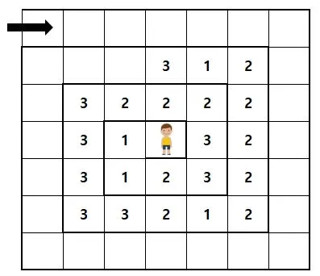
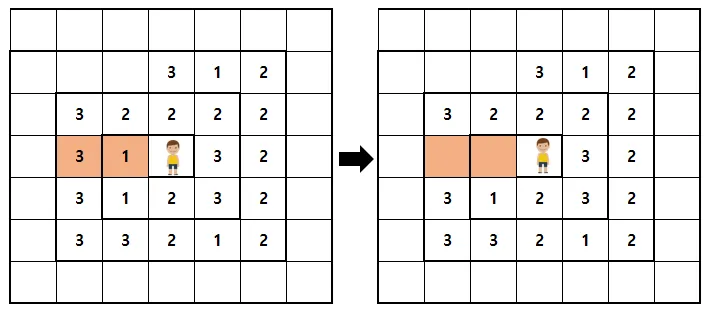
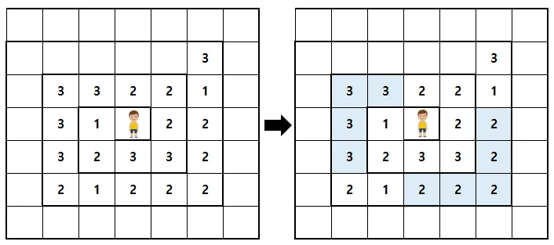
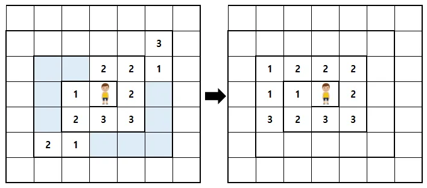
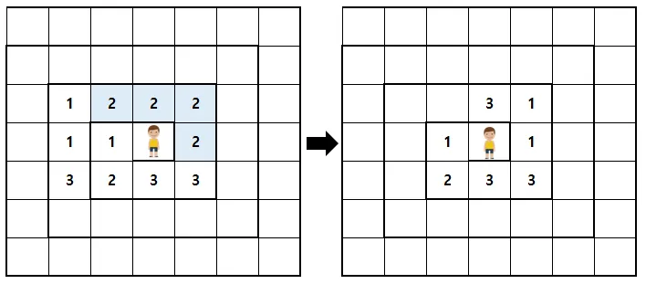
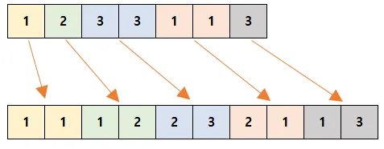
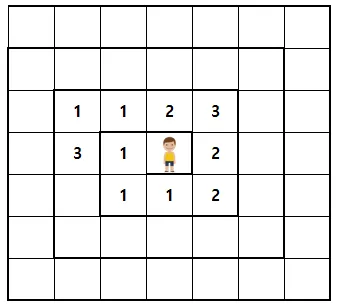

### 문제


정올이는 n x n으로 이뤄진 나선형 모양의 격자 안에서 풍선 터트리기 놀이를 하고 있다.

풍선의 종류는 1번, 2번, 3번이 있고, 정올이는 격자 속 중앙에서 다트를 날려 풍선을 터트릴 수 있다.

풍선은 아래 그림과 같이 화살표 방향으로 들어가서 순서대로 각 칸에 떠다닌다.




놀이는 다음과 같이 이루어진다.


1. 정올이는 상하좌우 방향 중 주어진 공격 칸 수만큼 다트를 날려 풍선을 터트릴 수 있다. 아래 그림은 왼쪽 방향으로 2칸 공격하여 풍선을 터트린 결과이다.




2. 비어있는 공간만큼 풍선은 앞으로 이동하여 빈 공간을 채운다. 그리고 이 때 같은 종류의 풍선이 4개 이상 중복으로 연속된 경우 해당 풍선들도 터진다.




3. 터진 이후에는 풍선들을 다시 앞으로 당겨주고, 4개 이상 중복된 같은 종류의 풍선이 있을 경우 또 터지고, 터지는 풍선이 없을 때까지 반복한다.




4.

5. 더 이상 터지는 풍선이 없는 상태가 되면, 남은 풍선들을 차례대로 나열한 후 그룹을 짓는다. 숫자가 하나인 경우 혼자 하나의 그룹이 되고, 같은 숫자가 연속되는 경우는 그 숫자들이 또 하나의 그룹이 된다. 아래 그림은 각각의 그룹을 다른 색으로 표시한 것이다. 이후 각각의 풍선 그룹은 (그룹을 이루는 원소의 개수, 원소 숫자)로 변하여 다시 격자 안으로 들어간다. 노란색 1번 풍선 그룹의 경우, 하나의 1번 혼자 그룹을 이루었기 때문에 1, 1로 변한다. 보라색 3번 풍선 그룹의 경우, 2개의 3번 풍선이 하나의 그룹을 이루었기 때문에 2, 3으로 변한다.




만약 새로 생긴 배열이 원래 격자의 범위를 넘는다면 넘어가는 배열은 무시한다.


해당 과정이 끝나면 한 라운드가 끝나게 된다. 1 ~ 3 과정에서 터지는 풍선의 번호는 점수에 합쳐진다. 예를 들어 위의 1번 과정에서는 총 (1∗1)+(3∗1)=4점이 추가되고, 2번 과정에서는 (3∗4)+(2∗5)=22 점이, 3번 과정에서는 2∗4=8점이 추가되어 해당 라운드에서 합쳐진 점수는 총 34점이다.


각 라운드별로 다트를 던지는 방향과 공격하는 칸 수가 주어질 때 모든 라운드가 끝난 후 정올이가 얻게 되는 점수는 몇 점인지 구하는 프로그램을 작성해보자.​


### 입력
첫번째 줄에는 격자의 크기 n, 총 라운드 수 m이 주어잔다. (7 ≤ n ≤ 25(n은 홀수), 1 ≤ m ≤ 100)

이후 두번째 줄부터 n + 1 번째 줄까지 풍선의 종류가 숫자로주어진다. 0은 비어있는 칸을 의미한다. (0 ≤ (주어지는 풍선의 종류) ≤ 3)

이후 m개의 줄에는 각 라운드마다의 정올이의 공격 방향 d와 공격 칸 수 p가 주어진다. (0 ≤ d ≤ 3, 1 ≤ p ≤ floor(n/2))

d는 0번부터 3번까지 각각 → ↓ ← ↑으로 주어진다.


입력되는 풍선의 줄 사이에는 공백이 존재하지 않는다.

정올이가 있는 중앙 칸은 풍선이 주어지지 않는다.​


### 출력
모든 라운드가 끝난 후 정올이가 얻은 점수를 출력한다.


### 예제1
입력
```
7 1
0 0 0 0 0 0 0
0 0 0 3 1 2 0
0 3 2 2 2 2 0
0 3 1 0 3 2 0
0 3 1 2 3 2 0
0 3 3 2 1 2 0
0 0 0 0 0 0 0
2 2
```

출력
```
34
```

### 예제2
입력
```
7 2
0 0 0 0 0 0 0
0 0 0 3 1 2 0
0 3 2 2 2 2 0
0 3 1 0 3 2 0
0 3 1 2 3 2 0
0 3 3 2 1 2 0
0 0 0 0 0 0 0
2 2
1 3
```

출력
```
35
```

### 예제3
입력
```
7 4
0 0 0 0 0 0 0
0 0 0 3 1 2 0
0 3 2 2 2 2 0
0 3 1 0 3 2 0
0 3 1 2 3 2 0
0 3 3 2 1 2 0
0 0 0 0 0 0 0
2 2
1 3
0 1
3 4
```

출력
```
37
```