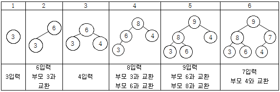

### 문제


정올이는 정수 배열을 입력받아 빠르게 정렬하는 임무를 부여받았다.

어떤 방법으로 정렬할까 망설이던 정올이는 배열을 max_heap구조로 만들어서 정렬하기로 했다. 

그 과정은 다음과 같다.

우선 push_heap 함수를 만들어 놓고 한 개씩 입력을 받을 때마다 함수를 실행해서 

계속 max_heap의 구조가 유지되도록 하면서 입력을 모두 끝낸다.

그리고 입력이 제대로 진행되었는지 확인하기 위해 모든 자료를 출력한다.

 

예를 들어 입력 자료가 3 6 4 8 9 7 이렇게 6개라고 하면 입력받아서 처리하는 과정은 아래와 같고 출력을 하면 9 8 7 3 6 4가 된다. 




입력이 끝나면 pop_heap 함수를 만들어서 첫 번째와 마지막 자료를 바꾼후 pop_heap을 호출하여 

마지막 자료를 제외한 나머지가 max_heap의 구조가 유지되도록 하는 작업을 자료의 개수만큼 반복하여 정렬을 끝낸다. 

그리고 최종적으로 오름차순으로 정렬된 자료를 모두 출력한다.

 

정올이를 도와 위와같이 출력하는 프로그램을 작성해 주자.


### 입력
첫 번째 줄에는 데이터의 개수 N이 입력된다. (1≤N≤500,000) 두 번째 줄에 N개의 숫자가 공백으로 구분되어 입력된다. (1≤N개의 입력데이터 ≤21억)


### 출력
첫 번째 줄에는 입력을 받으면서 max_heap의 구조가 된 N개의 숫자를 차례로 출력한다. 두 번째 줄에는 힙정렬을 끝내고 오름차순으로 정렬된 자료를 차례로 출력한다.


### 예제1
입력
```
6 
3 6 4 8 9 7
```

출력
```
9 8 7 3 6 4 
3 4 6 7 8 9
```

### 예제2
입력
```
8
9 6 9 1 6 3 3 4
```

출력
```
9 6 9 4 6 3 3 1
1 3 3 4 6 6 9 9
```