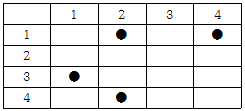

## 점 모으기

### 문제


행의 크기와 열의 크기가 각각 N인 격자공간에 M개의 점이 있다. N=4이고 M=4인 경우의 예가 아래에 있다.

격자공간 왼쪽의 숫자는 행 번호이며, 위의 숫자는 열 번호를 나타낸다.

그리고 격자공간내의 각 사각형의 위치는 (행 번호, 열 번호)로 표시한다.




이제 격자공간에 있는 모든 점들을 하나의 사각형안으로 모으려고 한다.

어떤 점을 움직일 때는 그 점이 들어있는 사각형에서 상하좌우로 인접한 사각형으로만 움직일 수 있다.

여기에서는 격자공간내의 한 사각형으로 모든 점들을 모을 때 각 점이 움직인 거리의 합을 고려한다.

예를 들어, 위의 점들을 (3,2)에 있는 사각형으로 모을 때 최단거리로 점들을 이동시킨다면 (1,2)에 있는 점의 이동거리는 2이고,

(3,1)과 (4,2)에 있는 점의 이동거리는 각각 1이며, (1,4) 에 있는 점의 이동거리는 4이므로 점들이 움직인거리의 합은 8이다.

또, 위의 모든 점들을 (1,2)의 위치로 모을 때도 점들이 이동한 거리의 합이 8 임을 알 수 있다.

위의 예에서는 점들을 어떤 하나의 사각형으로 모을 때 이동거리의 합이 8보다 작게 되는 사각형은 없다.

이 문제는 주어진 격자공간에 있는 모든 점들을 하나의 사각형으로 모을 때 드는 이동거리의 합의 최솟값을 구하는 것이다.

주어진 격자공간에서는 하나의 사각형에 여러 개의 점들이 들어 있을 수도 있고,

점들을 모을 때는 어떤 점이 들어 있는 사각형으로도 모을 수 있다고 가정한다.


### 입력
첫 줄에는 격자공간의 크기와 점들의 개수를 나타내는 두 정수 N과 M이 하나의 공백을 사이에 두고 주어진다.

다음의 M줄에는 각 줄마다 격자공간내의 점의 위치를 나타내는 두 개의 정수가 하나의 공백을 사이에 두고 주어진다.

단, N의 크기는 1이상 10,000이하이고, M의 크기는 1이상 100,000이하이다.


### 출력
여러분은 모든 점들을 하나의 사각형으로 모을 때 드는 이동거리의 합의 최솟값을 출력해야 한다.


###예제
입력
```
4 4
1 2
1 4
3 1
4 2
```

출력
```
8
```