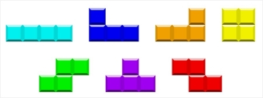

## 테트리스2

### 문제


3 * 3 크기의 2차원 테이블에 일부 테트리스 유형뿐만 아니라

아래 그림과 같이 하나 이상의 셀이 채워진 블록이 주어진다.




이 블록을 쌓아갈때 가로줄이 모두 채워지면 그 가로줄은 삭제된다.

주어진 모든 블록을 쌓은 후 최종적으로 남은 블록중 최대 높이를 구하는 프로그램을 작성하시오.

블록 정보에서 채워진 곳은 1, 비어있는 곳은 0으로 표시된다.


### 입력
첫 번째 줄에 테트리스의 가로줄의 크기 N과 블록의 개수 M이 주어진다. (3 <= N <= 20, 5 <= M <= 10000)

다음 줄부터 M줄에 걸쳐 블록의 정보와 회전수 R( 0 <= R <= 1,000) 및 이동 수 S( 0 <= S <= 1,000)가 입력된다.

블록의 정보는 0과 1로 이루어진 9개의 정수로 표시되며 3개씩 묶어서 한 행을 나타낸다.

회전수는 시계방향으로 90도씩 회전하는 횟수를 의미한다.

초기 위치는 회전수만큼 회전을 끝낸 후 좌표에서 블록을 왼쪽 벽에 붙인 상태에서 오른쪽으로 이동하는 횟수를 의미한다.

이 때 블록의 왼쪽이 모두 비어 있으면 왼쪽으로 이동하여 1개라도 채워있는 곳을 왼쪽 벽에 붙인 후 오른쪽으로 이동하여야 하며 이동 후 블록의 채워진 값이 오른쪽 벽을 넘어갈 경우에는 오른쪽 벽에 붙인다.


### 출력
입력되는 블록을 밑으로 떨어뜨려서 가로줄이 채워지면 해당 줄을 모두 제거하는 작업을 반복한 후 최대 높이를 출력한다.


### 예제1
입력
```
10 10
1 1 1 0 1 0 0 1 0 2 0
1 0 0 1 0 0 1 0 0 1 4
0 1 0 1 1 1 0 1 0 2 2
1 0 0 1 0 0 1 0 0 0 9
1 1 0 0 1 0 0 1 1 2 6
1 1 1 0 0 1 0 0 1 0 6
1 0 0 1 0 0 1 0 0 0 5
1 1 1 0 0 1 0 0 1 3 0
1 1 1 0 1 0 0 0 0 1 3
1 0 0 1 0 0 1 0 0 0 9
```

출력
```
4
```

### 예제2
입력
```
10 7
0 0 0 1 1 1 0 0 1 0 0
0 0 0 1 1 1 1 1 1 4 3
0 0 0 1 1 0 1 1 0 0 6
1 1 0 1 1 0 1 1 0 0 9
1 0 0 1 1 0 1 1 0 5 0
1 1 1 0 0 0 0 0 0 6 3
1 1 0 0 0 0 0 0 0 2 6
```

출력
```
0
```